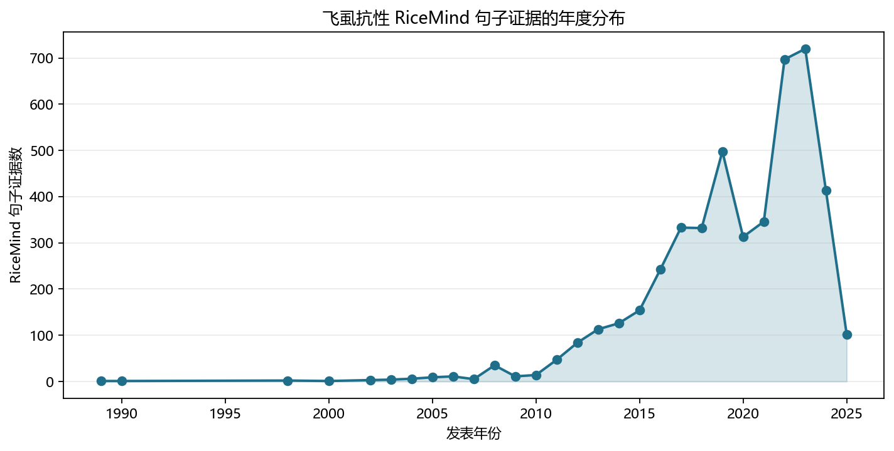
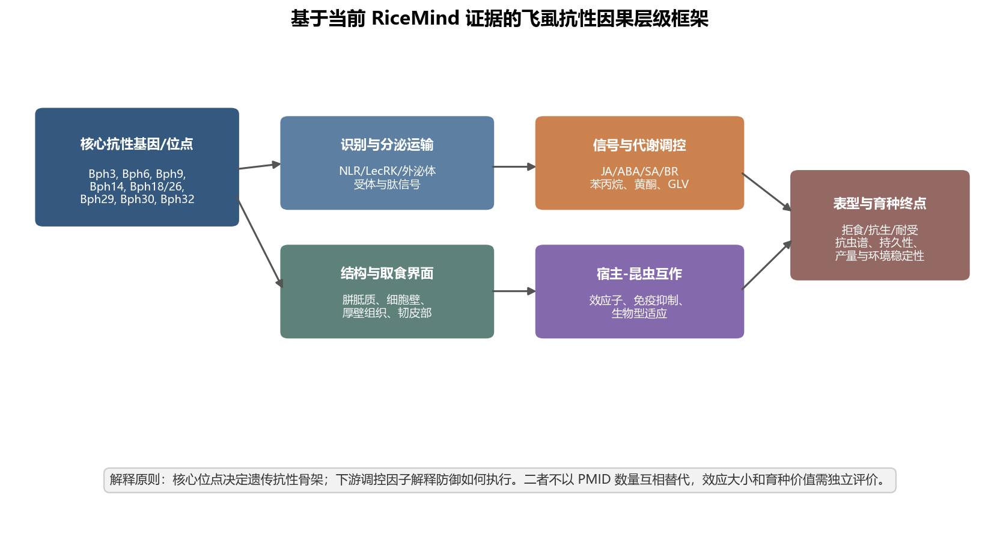
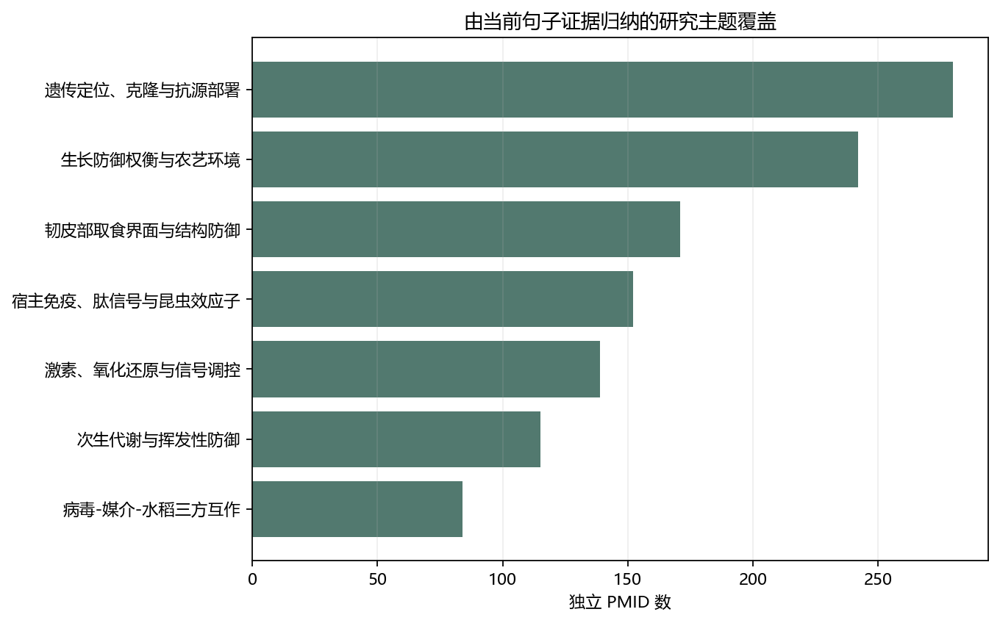
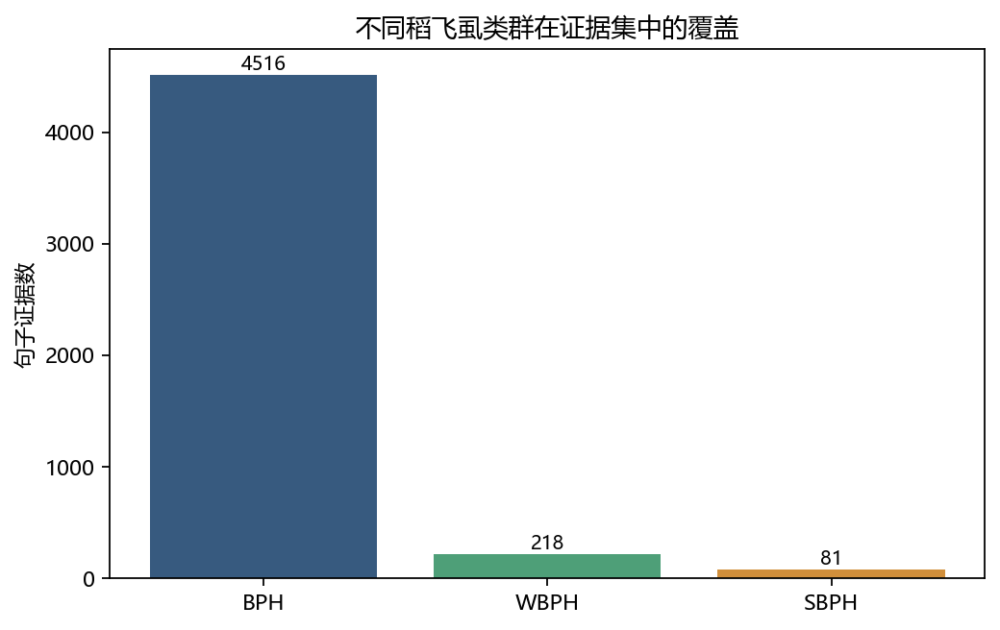
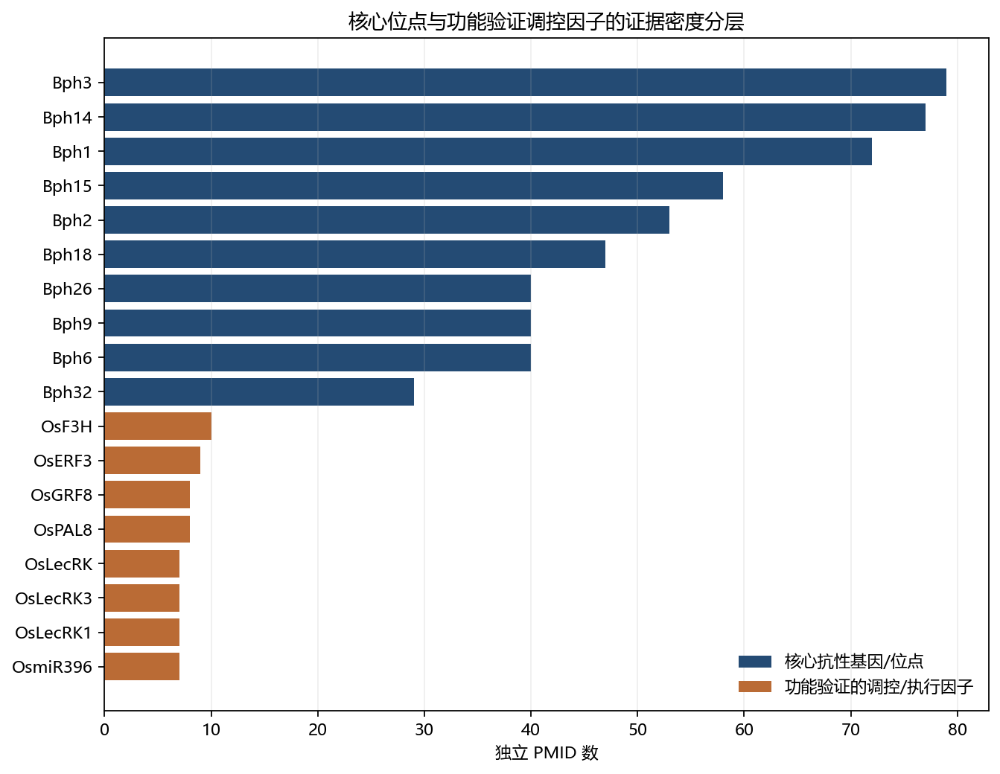
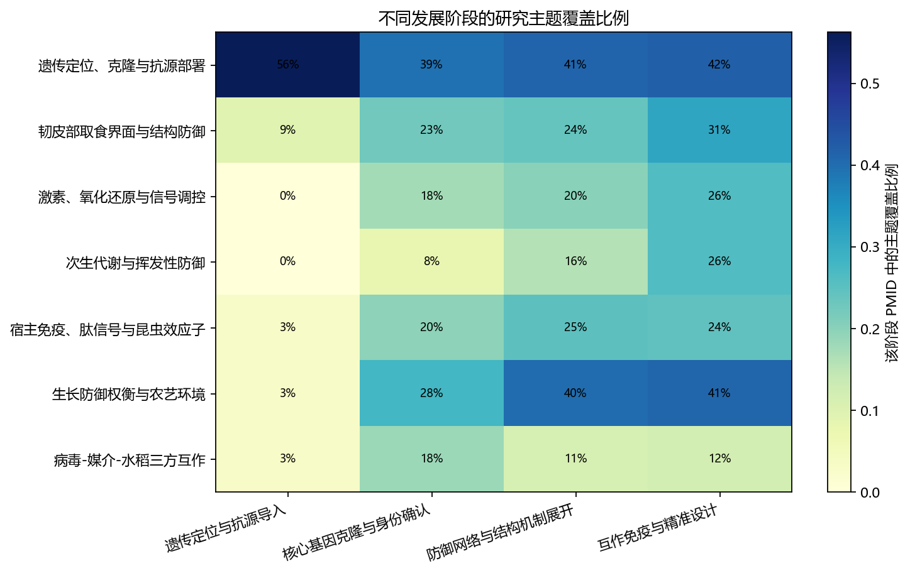
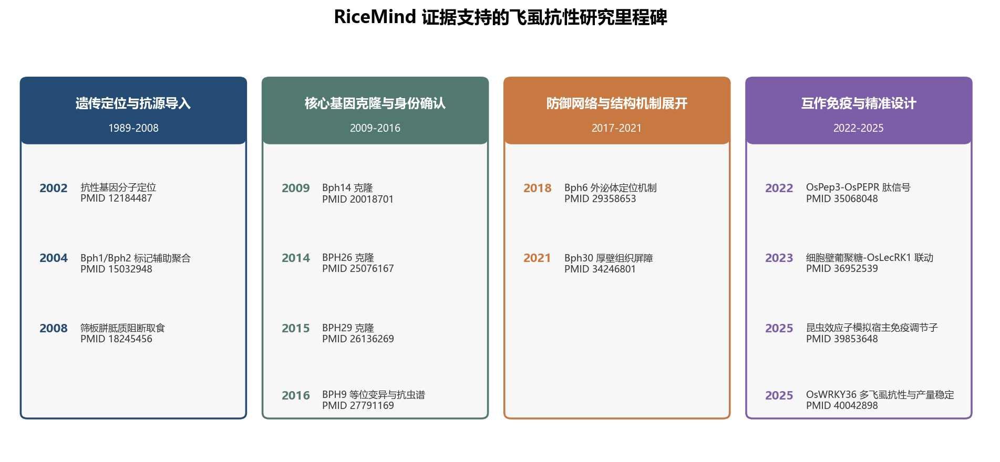

# 基于 RiceMind 证据的水稻飞虱抗性基因分子机理综述

**证据快照：2026 年 6 月 5 日**  
**报告生成：2026 年 6 月 11 日**  
**数据来源：RiceMind API 导出句子证据、文献元数据及本报告重新生成的分析 sidecar**

## 摘要

水稻飞虱抗性研究同时包含两个必须分开回答的问题：哪些遗传因子能够在育种群体中建立稳定而显著的抗性，以及这些遗传因子通过哪些细胞、代谢和免疫过程限制飞虱取食与繁殖。本报告基于 RiceMind 的本地完整导出重新构建证据集，不读取或沿用既有报告正文。经去重后，共纳入 4,623 条句子证据、671 个 PMID 和 154 种期刊，时间跨度为 1989–2025 年。褐飞虱（BPH）证据为主体，同时保留白背飞虱（WBPH）和灰飞虱（SBPH）的比较证据。

证据综合表明，水稻飞虱抗性的遗传骨架首先由已定位、克隆或反复用于导入与聚合育种的 Bph 基因和位点构成。其中，Bph14、Bph9、Bph6、BPH26/Bph18、BPH29、Bph32 和 Bph30 已形成从遗传定位到分子身份或直接功能验证的较完整证据链；Bph3 表现为受体激酶基因簇并具有跨飞虱类群的抗性价值；Bph15 具有较成熟的育种利用证据，但其分子因果链仍未像部分已克隆基因那样完全闭合。相较之下，OsMYB30–OsPAL6/OsPAL8、OsmiR396–OsGRF8–OsF3H、OsMKK3、OsNCED3、OsPep3–OsPEPRs 和 OsmiR319–OsPCF5 等模块主要解释抗性如何被执行或调节，不应仅凭文献数量或机制叙述完整度被提升为主效抗性基因。

从机制上看，当前证据支持四条相互连接但不可互相替代的因果链。第一，NLR、凝集素受体激酶和外泌体相关蛋白参与遗传识别、膜定位和防御物质运输；第二，筛板胼胝质、细胞壁葡聚糖、木质素和厚壁组织共同限制口针到达或维持韧皮部取食；第三，JA、ABA、SA、BR、乙烯和氧化还原信号调节防御强度，并与苯丙烷、黄酮和绿色叶挥发物代谢相连；第四，宿主肽信号和昆虫效应子之间的对抗揭示了飞虱适应性与抗性失效的分子基础。育种上最稳健的策略仍是以核心抗性基因为骨架，通过不同作用机制的位点聚合提高抗性谱和持久性，再谨慎利用下游调控因子进行增强。任何负调控因子的编辑均需与生长、产量、环境适应性和病虫间权衡同时评价。

**关键词：** 水稻；褐飞虱；白背飞虱；Bph 基因；抗性育种；韧皮部取食；效应子；RiceMind

## 1. 数据范围、检索状态与证据边界

### 1.1 RiceMind 证据集的构建

本报告使用 RiceMind API 于 2026 年 6 月 5 日导出的 `brown planthopper resistance` 完整分页结果，并合并同批 `insect resistance` 和 `pest resistance` 导出中明确提及 BPH、WBPH、SBPH 或其学名的句子。最终证据集保留 PMID、年份、期刊、题名、句子编号和原始句子文本，并以 PMID、句子编号和文本联合去重。

| 指标 | 本报告使用的数据 |
|---|---:|
| 去重句子证据 | 4,623 |
| 独立 PMID | 671 |
| 期刊数 | 154 |
| 时间跨度 | 1989–2025 |
| BPH 相关句证 | 4,516 |
| WBPH 相关句证 | 218 |
| SBPH 相关句证 | 81 |

2026 年 6 月 11 日生成报告时，RiceMind 在线接口连续多次在大分页和小分页请求中超时，因此没有将不完整的实时响应与完整本地快照混合。报告的时间上限为 2025 年，不能被解释为截至 2026 年 6 月的实时系统综述。

### 1.2 三类评价轴必须分开

本报告不设置一个把所有基因混在一起的“综合重要性排名”。候选对象分别沿以下三个轴评价：

1. **遗传架构角色：** 核心抗性基因或位点、主效位点下游修饰因子、功能执行因子、表达或组学关联候选。
2. **机制证据强度：** 定位或克隆、敲除或过表达、互补与等位变异、生化和细胞证据、表达相关或文本共现。
3. **育种应用成熟度：** 功能标记、近等基因系、导入或聚合、多遗传背景、多飞虱种群、田间表现、产量和环境稳定性。

RiceMind 中的句子数、PMID 数或 GTA confidence tier 表示证据密度和来源构成，不等同于遗传效应大小，也不等同于育种价值。除非原句明确报告表型方差、效应量、LOD、主效或微效结论，本报告将效应大小标为“未报告或不可由文献频次推断”。

## 2. 证据版图及其解释限制

### 2.1 研究关注在 2016 年后快速扩展

年度分布显示，飞虱抗性句子证据在 2016 年后明显增加，并在 2022–2023 年达到高位。这一增长不仅来自新抗性位点，还来自转录组、代谢组、昆虫毒力、病毒媒介、受体和效应子研究的扩展。因此，后期文献量增长不能被简单解释为新育种基因数量同比增加，而是研究问题由“抗性在哪里”扩展到“抗性如何执行、为何失效以及如何降低代价”。2025 年记录下降同时受到年度尚未结束后的索引滞后和当前 RiceMind 快照收录边界影响，不能解释为研究活动真实下降。

证据主题存在显著重叠。遗传定位、克隆和抗源部署涉及 280 个 PMID；生长、防御和农艺环境涉及 242 个 PMID；韧皮部与结构防御涉及 171 个 PMID；宿主免疫和昆虫效应子涉及 152 个 PMID；激素与氧化还原涉及 139 个 PMID；次生代谢和挥发物涉及 115 个 PMID。一个 PMID 可以同时进入多个主题，因而这些数值只能表示覆盖度。

### 2.2 BPH 是主体，WBPH 和 SBPH 主要提供抗性谱检验

BPH 相关句证远多于 WBPH 和 SBPH。由此得到的机制框架首先是 BPH 框架，不能无条件外推到所有稻飞虱。WBPH 和 SBPH 证据的主要价值是检验某一抗性基因或调控模块是否具有跨物种效应。例如，Bph6 被报告具有广谱飞虱抗性 [29358653]；Bph3 受体激酶基因簇与 BPH 和 WBPH 抗性均有关 [37752622, 38625904]；OsRLK7-1 敲除同时增强 BPH 和 WBPH 抗性但损害生长 [37834016]；OsWRKY36 敲除则被报告可增强 BPH、WBPH 和 SBPH 抗性并维持产量稳定 [40042898]。这些结果提示“跨飞虱抗性”是可检验的独立性状，而不是 BPH 抗性的默认附属属性。

## 3. 抗性的遗传骨架：核心基因、等位复合体与育种抗源

### 3.1 已克隆或直接功能验证的核心抗性基因

核心抗性基因的共同特征不是 PMID 数多，而是具有可追溯的遗传分离、图位克隆、直接功能验证或稳定导入证据。Bph14 是这一证据链的代表：研究通过图位克隆获得 Bph14，并证明其在苗期和成熟期均赋予 BPH 抗性 [20018701]；后续功能标记和 Bph14/Bph15 导入研究使其具备直接育种操作性 [21254325, 24273431]。

Bph9 体现了等位多样性与抗性谱之间的关系。该基因首先经历遗传定位，随后被克隆为 NLR 基因；不同等位变异能够应对飞虱种群变化，并通过 SA 和 JA 信号表现拒食与抗生作用 [16553215, 27791169]。这说明同一位点的不同等位基因不能被当作完全相同的育种元件，其抗性强度和抗性谱需要在目标生物型和环境中分别评价。

Bph6 编码外泌体定位蛋白，图位克隆和功能分析支持其对多种飞虱的广谱抗性 [29358653]。它把核心抗性基因的作用从传统受体识别扩展到膜运输和分泌过程。BPH26 和 Bph18 均位于重要的第 12 染色体长臂抗性区段，并分别在栽培稻和野生稻供体中获得高分辨率定位或克隆证据 [25076167, 27682162]。RiceMind 句证提示 BPH18 与 BPH26 位于同一位点或等位区段，因此在聚合设计中不能简单把二者当作两个完全独立、必然可加的基因。

BPH29 是由野生稻导入材料获得的隐性 B3 结构域抗性基因 [26136269]。其隐性遗传和低表达特征意味着育种部署方式与显性 NLR 基因不同。Bph32 编码 SCR 结构域蛋白并表现抗生性 [27876888]。Bph30 则提供了最直接的组织结构证据：该基因通过强化叶鞘厚壁组织阻止飞虱口针到达韧皮部 [34246801]。这些基因说明核心抗性骨架并非单一受体家族，而是包含免疫识别、分泌运输、组织结构和转录调控等不同分子类型。

### 3.2 Bph3 与 Bph15：育种价值和分子闭合程度并不总同步

Bph3 的当前证据支持一个由 OsLecRK1–OsLecRK3 构成的凝集素受体激酶基因簇，该基因簇定位于质膜并与 BPH、WBPH 的广谱抗性有关 [37752622, 38625904]。Bph3 已有标记辅助导入记录，其育种价值来自较广抗性谱和多基因簇协同，而不仅是文献出现频率。

Bph15 的情况不同。它具有高分辨率定位、BAC/RNA 测序、近等基因系、导入和聚合育种证据 [15549231, 21254325, 25109872]，因而是成熟抗源；但近年的句证仍明确指出其精确机制尚未完全阐明 [38562566]。OsWRKY71 敲除会削弱 Bph15 介导的抗性，证明它是 Bph15 背景中的重要下游调控因子 [38023936]。因此，Bph15 的育种成熟度较高，但其分子因果链仍需继续闭合。这两种评价不能相互替代。

### 3.3 核心抗性基因不应被下游机制因子取代

| 对象 | 遗传角色 | 直接证据 | 育种判断 |
|---|---|---|---|
| Bph14 | 克隆的核心抗性基因 | 图位克隆、功能标记、导入 | 可作为聚合骨架，但需监测生物型适应 |
| Bph3 | 受体激酶基因簇型核心位点 | 基因簇、广谱抗性、标记导入 | 适合作为跨 BPH/WBPH 抗源 |
| Bph6 | 克隆的核心抗性基因 | 外泌体定位、广谱飞虱抗性 | 适合与不同作用机制基因聚合 |
| Bph9 等位簇 | NLR 复等位核心位点 | 克隆、等位变异、拒食和抗生 | 必须按等位基因和目标生物型评价 |
| Bph18/BPH26 | 同区段核心抗性资源 | 克隆或高分辨率定位、MAS | 聚合时避免重复计算同位点贡献 |
| BPH29 | 隐性核心抗性基因 | 图位克隆、B3 结构域 | 需按隐性遗传设计回交和固定 |
| Bph32 | SCR 结构域核心基因 | 直接抗性与近等基因系证据 | 需补足多环境持久性 |
| Bph30 | 结构屏障型核心基因 | 厚壁组织阻止口针到达韧皮部 | 需评价结构强化的农艺代价 |
| Bph15 | 成熟核心抗性位点 | 定位、测序、NIL、聚合 | 育种成熟，但机制尚未完全闭合 |

图 5 仅反映 RiceMind 文献证据密度。它不能用来推断效应大小，也不能据此把高频调控因子排在低频核心位点之前。

## 4. 核心基因如何转化为抗性表型

### 4.1 识别、膜定位和分泌运输构成抗性启动层

核心基因在分子身份上表现出显著异质性。Bph14 和 Bph9 属于 NLR 相关免疫识别体系 [20018701, 27791169]；Bph3 由质膜凝集素受体激酶基因簇构成 [37752622, 38625904]；Bph6 与外泌体定位和分泌运输相关 [29358653]。这些证据支持一个比“所有 Bph 基因都是受体”更准确的结论：抗性启动可以发生在胞内免疫识别、质膜受体感知或分泌运输控制等不同位置。

这些核心基因之间的机制差异是聚合育种的重要依据。如果两个基因位于同一等位区段或主要调用相同下游通路，简单叠加未必产生独立增益；如果分别作用于识别、运输和结构屏障，则更可能形成互补。但 RiceMind 句证通常不提供可直接比较的遗传效应量，因此“机制互补”仍需通过近等基因系和同背景聚合材料验证。

### 4.2 韧皮部取食界面是最接近抗性终点的执行层

飞虱抗性的特殊性首先来自取食方式。BPH 依赖口针持续进入韧皮部，因而宿主能否阻止到达筛管、封闭筛板或改变韧皮部环境，直接决定昆虫取食成功率。早期研究证明 BPH 取食诱导筛板胼胝质沉积，并阻止昆虫摄取韧皮部汁液 [18245456]。Bph30 进一步把结构屏障前移到叶鞘厚壁组织，使口针难以抵达韧皮部 [34246801]。

细胞壁不仅是被动屏障。Poaceae 特异的 β-1,3;1,4-葡聚糖与 OsLecRK1 介导的防御和 JA 信号相连；OsCslF6 遗传操作及 OsLecRK1/OsLecRK3 背景分析表明，细胞壁组成、受体积累和防御信号之间存在遗传联系 [36952539]。因此，结构抗性不应被概括为“细胞壁增厚”，而应具体区分口针路径、厚壁组织、筛板胼胝质、细胞壁化学组成和受体介导的完整性监测。

### 4.3 苯丙烷、黄酮和挥发物连接细胞壁与化学防御

OsMYB30–OsPAL6/OsPAL8 模块提供了直接遗传证据：OsPAL 敲低降低 BPH 抗性，而 OsPAL8 过表达提高感病材料的抗性，说明苯丙烷途径和木质素形成参与抗性执行 [31848246]。这类因子解释核心抗性如何转化为细胞壁和代谢输出，但其证据并未证明它们是决定自然材料抗性分离的主效位点。

OsmiR396–OsGRF8–OsF3H 模块把 miRNA 调控、黄酮合成和抗性连接起来。天然材料中的黄酮水平与抗性正相关，遗传和外源处理证据也支持 OsF3H 和黄酮在抗性中的正向作用 [30734457]。OsmiR319–OsPCF5 与 MYB 和苯丙烷通路的联系进一步表明，不同 miRNA 模块可以汇聚到相似的代谢输出 [38520013]。

绿色叶挥发物提供了直接防御和间接防御的连接。OsRCI-1 过表达提高 cis-3-hexen-1-ol 等挥发物，降低 BPH 取食和产卵偏好，同时增强对卵寄生蜂的吸引 [38891303]。但挥发物效应具有昆虫种类特异性，某些代谢改变对 BPH 和 WBPH 的方向可能不同，因此不能将“增强挥发物”概括为普遍增抗。

### 4.4 激素网络的作用是调节输出，不是取代遗传抗源

OsMKK3 过表达降低 BPH 若虫存活，并伴随 JA、JA-Ile 和 ABA 相关变化，支持其通过激素动态增强抗性 [31226870]。OsNCED3 的转录组、过表达和 RNAi 研究连续支持 ABA 生物合成对 BPH 抗性的正向作用，并显示 ABA 与 JA、JA-Ile、能量代谢和防御化合物之间存在联动 [36064309, 38988632]。

BR 的证据则提示激素作用并非统一正向。BR 通路可通过整合 SA 和 JA 促进 BPH 感病 [29893903]。因此，报告不采用“JA/ABA/SA 全部增强抗性”的线性模型，而将其视为受时间、组织、遗传背景和昆虫状态共同限制的调节网络。验证某一激素因子的育种价值，必须在核心抗性基因背景、不同生物型和正常田间养分条件下测定，而不能只依据外源处理或单一过表达材料。

### 4.5 内源肽信号和昆虫效应子把研究推进到互作免疫层

OsPep3–OsPEPRs 是宿主侧较清楚的内源免疫证据。OsPep3 处理降低 BPH 蜜露和增重，受体与转录代谢分析共同支持该肽信号通过 JA、细胞外防御、脂质和次生代谢增强抗性 [35068048]。这说明飞虱抗性不仅由经典 Bph 位点启动，还能被损伤或危险相关肽信号放大。

昆虫侧证据显示，BPH 效应子可以模拟宿主调节子并利用 OsGF14e–OsEDR1l 免疫抑制模块。OsGF14e 或 OsEDR1l 过表达使水稻更感病，敲除提高抗性，但同时损害生长和籽粒产量 [39853648]。该研究的重要性不在于提供一个可以直接完全敲除的育种基因，而在于证明飞虱能够主动操纵宿主免疫制动系统。它为弱等位基因、组织特异或诱导型编辑提供了方向，也明确揭示了完全解除免疫抑制的代价。

## 5. 调控因子的价值：解释机制、修饰效应和暴露权衡

### 5.1 机制因子不能按文献热度升级为主效位点

| 调控对象 | 当前直接证据 | 可以支持的结论 | 不能支持的结论 |
|---|---|---|---|
| OsMYB30–OsPAL6/8 | 敲低、过表达、木质素/苯丙烷 | 参与抗性执行和结构代谢 | 是主要抗源或可替代 Bph 基因 |
| OsmiR396–OsGRF8–OsF3H | 遗传操作、黄酮和抗性表型 | 黄酮通路是下游防御模块 | 文献多即效应大 |
| OsMKK3 | 过表达、昆虫存活和激素测定 | 调节 JA/ABA 相关输出 | 已具备田间育种成熟度 |
| OsNCED3 | 过表达、RNAi、EPG、代谢和激素 | ABA 生物合成正向调控抗性 | 是自然群体中的主效位点 |
| OsPep3–OsPEPRs | 肽处理、受体和多组学 | 内源肽信号可放大防御 | 外源诱抗等同于稳定遗传改良 |
| OsWRKY71 | Bph15 背景敲除 | 是 Bph15 下游必要调控因子 | 是脱离 Bph15 的独立主效抗性基因 |
| OsGF14e–OsEDR1l | 过表达和敲除 | 是昆虫利用的宿主免疫抑制模块 | 完全敲除可无代价直接育种 |
| OsWRKY36 | CRISPR 敲除、多飞虱和产量评价 | 具有广谱和转化潜力 | 单项研究已证明跨环境稳定 |

这些模块对于解释抗性机制非常重要，但育种应用必须回答额外问题：效应是否在不同核心抗性背景中保持、是否改变产量或熟期、是否增加其他病虫风险、是否在田间虫压和养分条件下稳定，以及昆虫能否通过效应子或行为变化快速适应。

### 5.2 负调控释放具有编辑吸引力，也最容易产生过度推断

OM64 缺失材料来自大规模突变体筛选并表现 BPH 抗性增强 [32542992]。OsI-BAK1 沉默增强抗性并改变乙烯和 WRKY 响应 [34830062]。OsRLK7-1 敲除增强 BPH/WBPH 抗性，但同时损害水稻生长发育 [37834016]。OsEXPA10 则表现出明确的双向权衡：过表达促进生长却增加 BPH 和稻瘟病感病性，敲低提高抗性但降低株高和粒型 [29619515]。

因此，负调控因子更适合作为等位基因优化、启动子编辑、组织特异表达或诱导型调控的对象，而不是默认采用完全敲除。OsWRKY36 的单项研究报告其敲除同时提高多飞虱和病害抗性并维持产量稳定 [40042898]，是值得独立重复的潜在例外，但在多遗传背景、多地点和多季验证前，不宜把“突破生长–防御权衡”视为已经普遍成立。

## 6. 抗性谱、持久性和环境依赖

### 6.1 抗性、耐受和拒食是不同表型

飞虱研究常同时使用植株死亡、虫体增重、存活率、蜜露、产卵、定殖、口针波形和最终产量。它们分别对应抗生性、拒食性、组织防御和耐受性，不能合并成单一“抗性评分”。例如，氮肥可降低某些材料的抗性，却提高快速生长材料对虫害的补偿耐受能力 [34821791]。如果只记录植株最终生物量，可能把昆虫适合度增加掩盖为耐受提高；如果只记录昆虫死亡，又可能忽略产量代价。

### 6.2 聚合育种需要同时考虑等位关系和昆虫适应

早期标记辅助研究已经证明 Bph1/Bph2 和其他抗性基因可以被聚合 [15032948, 22048639]。近年的证据进一步显示，在气候变化条件下，聚合具有不同抗性特征的 BPH 基因可以维持较强抗性 [38015011]。但聚合并不自动等于持久。昆虫在无效或部分有效抗性基因上的连续暴露可能改变后续毒力，并削弱聚合材料的优势 [30393420]；聚合材料还可能产生非预期生态成本或阶段特异表现 [30739972]。

因此，聚合设计应优先组合不同因果层级和非等位区段的核心基因，同时在同一昆虫种群、同一遗传背景和同一环境中比较单基因近等系与聚合系。仅依据文献分别报道的高抗表型，无法证明两个基因在目标背景中具有加性或协同作用。

## 7. 学科发展脉络：从抗源定位到互作系统设计

### 7.1 1989–2008：抗性资源、遗传定位和育种导入

这一阶段的主要问题是发现抗源、确定遗传方式、定位抗性位点并建立分子标记。Bph1/Bph2 的标记辅助聚合、Bph15 和 Bph18 的高分辨率定位均属于这一范式 [15032948, 15549231, 16240104]。2008 年筛板胼胝质研究首次把遗传抗性与直接取食阻断联系起来 [18245456]，为后续从 QTL 走向细胞机制提供了生理终点。

### 7.2 2009–2016：核心基因克隆和分子身份确认

Bph14 的克隆标志着 NLR 免疫识别进入飞虱抗性研究 [20018701]。随后 BPH26、BPH29、Bph18、Bph9 和 Bph32 等基因被克隆或完成分子身份解析 [25076167, 26136269, 27682162, 27791169, 27876888]。这一阶段最重要的学术进展不是“发现更多热点基因”，而是证明不同抗性位点对应不同蛋白类型、遗传方式和抗性谱，并识别第 12 染色体等位复合区段。

### 7.3 2017–2021：结构、代谢和信号网络展开

Bph6 将抗性与外泌体和分泌运输相连 [29358653]；OsmiR396–OsGRF8–OsF3H 和 OsMYB30–OsPAL 模块分别把黄酮、苯丙烷和木质素纳入因果链 [30734457, 31848246]；Bph30 证明厚壁组织可以在口针到达韧皮部之前形成物理屏障 [34246801]。与此同时，BR、JA、ABA 以及负调控基因研究揭示了抗性和生长之间的系统权衡 [29893903, 31226870, 32542992]。

### 7.4 2022–2025：宿主免疫、昆虫效应子和精准设计

OsPep3–OsPEPRs 证明内源肽信号可以增强刺吸式昆虫抗性 [35068048]；细胞壁葡聚糖、OsLecRK1 和 JA 的遗传联系进一步连接结构完整性与免疫感知 [36952539]；miRNA、挥发物和负调控受体研究扩大了可编辑靶点 [37834016, 38520013, 38891303]。2025 年的昆虫效应子模拟宿主调节子研究揭示 BPH 对 OsGF14e–OsEDR1l 的利用 [39853648]，而 OsWRKY36 研究把多飞虱抗性、病害抗性和产量稳定放入同一设计目标 [40042898]。

## 8. 面向育种决策的候选分层

### 8.1 第一层：可作为遗传骨架的抗性基因

优先对象应满足克隆或高质量定位、直接抗性表型、可操作标记或近等基因系、以及至少一种育种导入证据。Bph14、Bph3、Bph6、Bph9 等位簇、Bph18/BPH26、BPH29、Bph32、Bph30 和 Bph15 属于这一层。具体选择应根据目标飞虱种类、生物型、生态区、籼粳背景和是否存在同位点等位关系决定，而不是按文献总量选择“最热基因”。

### 8.2 第二层：用于增强、诊断或解释的机制因子

OsMYB30–PAL、miR396–GRF8–F3H、OsMKK3、OsNCED3、OsPep3–OsPEPRs、OsWRKY71 和 miR319–PCF5 具有直接功能证据，适合用于解释核心抗性背景的差异、开发分子诊断指标或进行有限增强。它们的首要实验不是与 Bph 基因争夺“最重要候选”排序，而是在统一遗传背景中测定是否对核心抗性基因产生稳定的增益、冗余或拮抗。

### 8.3 第三层：需要代价控制的编辑靶点

OsGF14e–OsEDR1l、OsRLK7-1、OsI-BAK1、OM64 和 OsEXPA10 等负调控因子具有编辑吸引力，但也最需要农艺风险控制。完全敲除只有在生长、产量、熟期、根系、病害和非目标昆虫评价均可接受时才具有实际意义。更合理的设计包括弱等位变异、启动子精细编辑、叶鞘或维管组织特异表达和受虫诱导表达。

| 应用层级 | 主要对象 | 当前可做的工作 | 进入育种应用前的关键门槛 |
|---|---|---|---|
| 遗传骨架 | 已克隆或成熟 Bph 基因/位点 | 功能标记、回交导入、非等位机制聚合 | 多生物型、多地点、全生育期和产量验证 |
| 机制增强 | PAL/黄酮/ABA/肽信号等模块 | 在单基因和聚合 NIL 中测定增益 | 证明效应独立于背景且无明显多效性 |
| 精准编辑 | 免疫负调控和生长防御节点 | 弱等位、启动子、组织特异编辑 | 排除生长、产量和其他病虫风险 |
| 探索候选 | 表达和多组学关联基因 | 独立突变、互补和等位验证 | 从相关性升级为因果证据 |

## 9. 当前证据的关键缺口

### 9.1 缺少统一的效应量和试验设计字段

RiceMind 句证可以追踪基因、机制和 PMID，但多数记录没有结构化保存抗性评分、虫体存活、蜜露、EPG 指标、产量损失、样本量、遗传背景、飞虱生物型和环境条件。因此，本报告不能严格比较 Bph14 与 Bph6 的效应大小，也不能比较某一 Bph 基因与 OsNCED3 过表达的育种贡献。未来数据库需要把效应量和试验条件作为独立字段，而不是依赖句子文本重建。

### 9.2 BPH 证据不能代表全部飞虱

WBPH 和 SBPH 证据量明显不足，许多研究仅在综述或比较句中提及它们。跨飞虱抗性需要同一材料、同一生育期和统一指标的平行接虫试验。尤其应关注同一代谢或挥发物改变对不同飞虱产生相反方向效应的情况。

### 9.3 抗性失效研究与分子机制研究尚未充分连接

抗性基因研究通常描述宿主表型，昆虫毒力研究则描述飞虱转录组、唾液蛋白或代谢适应。两类研究之间仍缺少“特定宿主等位基因—昆虫效应子或毒力等位基因—取食表型—田间种群演化”的闭环。OsGF14e–OsEDR1l 研究提供了一个可操作范例，但尚不能代表其他 Bph 基因的失效机制。

### 9.4 田间持久性和产量稳定证据不足

温室苗期死亡率仍是常见终点，但育种需要全生育期、自然虫压、不同氮肥和气候条件下的产量稳定性。氮肥和气候变化研究已经证明环境可以改变抗性与耐受的相对表现 [34821791, 38015011]。缺乏这些数据时，基因编辑或聚合材料的实验室高抗不能直接转化为品种推荐。

## 10. 未来研究路线图

### 10.1 建立“核心基因—执行模块—飞虱适合度”的同背景因果链

优先在 Bph14、Bph3、Bph6、Bph9 和 Bph30 等代表性核心基因的近等背景中，对胼胝质、细胞壁、黄酮、激素、蜜露、EPG、虫体增重和产量进行同批测定。随后用 PAL、F3H、NCED3、PEPR、WRKY 等突变或互补材料测试下游模块是否为必要环节。只有这样才能区分“与抗性同时发生”与“核心基因抗性所必需”。

### 10.2 用非等位和非冗余机制指导聚合

聚合组合应先排除 Bph18/BPH26、Bph9 复等位簇等同区段重复，再优先选择识别、运输和结构屏障等不同作用层级。每个组合都应与对应单基因 NIL 比较，而不是只与感病亲本比较。评价指标应包括抗性谱、抗性强度、持久性、产量和飞虱毒力演化速度。

### 10.3 把 WBPH、SBPH 和病毒媒介性状纳入统一设计

对候选核心基因和编辑靶点，应至少进行 BPH、WBPH 和 SBPH 平行筛选，并记录病毒携带状态。一个基因可能提高对飞虱本身的抗性，却改变病毒传播、天敌吸引或其他昆虫的适合度。跨物种和病毒媒介结果应作为独立决策指标。

### 10.4 由完全敲除转向精细等位基因设计

对 OsGF14e、OsEDR1l、OsRLK7-1、OsEXPA10 等具有明确生长代价的负调控因子，应优先测试启动子编辑、组织特异调控和部分功能等位基因。设计目标不是获得最大苗期抗性，而是在目标生态区获得可接受的抗性、产量和稳定性组合。

### 10.5 建立可计算的抗性证据标准

RiceMind 后续可增加以下结构化字段：研究对象是核心位点还是修饰因子；是否有遗传分离、克隆、敲除、过表达或互补；飞虱种类和生物型；遗传背景；温室或田间；生育期；抗生、拒食或耐受终点；效应量与不确定性；产量和生长代价。这样才能从“文献证据密度排序”升级为“遗传价值、机制确定性和育种成熟度的多轴决策”。

## 11. 结论

RiceMind 证据支持一个层级清楚的飞虱抗性框架。Bph 基因和位点首先构成可遗传、可导入和可聚合的抗性骨架；受体识别、分泌运输、厚壁组织和筛板封闭决定飞虱能否建立韧皮部取食；激素、苯丙烷、黄酮和挥发物调节防御输出；宿主肽信号与昆虫效应子对抗决定抗性的放大、抑制和失效。下游调控因子的机制价值很高，但不能凭 PMID 数量或叙述完整度取代核心抗性基因的遗传和育种地位。

对育种而言，近期最可靠的路线是以分子身份明确、抗性谱可验证的核心基因为骨架，按非等位和机制互补原则聚合，并在多飞虱种群、多环境和全生育期中评价持久性与产量。机制调控和负调控编辑应作为第二层优化工具。未来研究的关键不再只是继续增加候选基因数量，而是把核心位点、下游执行、昆虫适应和田间表现连接成可量化、可重复和可用于品种决策的因果链。

## 参考文献

1. Bph6 encodes an exocyst-localized protein and confers broad resistance to planthoppers in rice Nature genetics. 2018. PMID: 29358653. https://pubmed.ncbi.nlm.nih.gov/29358653/

2. Broad-spectrum resistance gene RPW8.1 balances immunity and growth via feedback regulation of WRKYs Plant biotechnology journal. 2023. PMID: 37752622. https://pubmed.ncbi.nlm.nih.gov/37752622/

3. Fine mapping and breeding application of two brown planthopper resistance genes derived from landrace rice PloS one. 2024. PMID: 38625904. https://pubmed.ncbi.nlm.nih.gov/38625904/

4. Knocking Out OsRLK7-1 Impairs Rice Growth and Development but Enhances Its Resistance to Planthoppers International journal of molecular sciences. 2023. PMID: 37834016. https://pubmed.ncbi.nlm.nih.gov/37834016/

5. A WRKY transcription factor confers broad-spectrum resistance to biotic stresses and yield stability in rice Proceedings of the National Academy of Sciences of the United States of America. 2025. PMID: 40042898. https://pubmed.ncbi.nlm.nih.gov/40042898/

6. Identification and characterization of Bph14, a gene conferring resistance to brown planthopper in rice Proceedings of the National Academy of Sciences of the United States of America. 2009. PMID: 20018701. https://pubmed.ncbi.nlm.nih.gov/20018701/

7. Biological effects of rice harbouring Bph14 and Bph15 on brown planthopper, Nilaparvata lugens Pest management science. 2011. PMID: 21254325. https://pubmed.ncbi.nlm.nih.gov/21254325/

8. Development and validation of a PCR-based functional marker system for the brown planthopper resistance gene Bph14 in rice Breeding science. 2013. PMID: 24273431. https://pubmed.ncbi.nlm.nih.gov/24273431/

9. SSR mapping of brown planthopper resistance gene Bph9 in Kaharamana, an Indica rice (Oryza sativa L.) Yi chuan xue bao = Acta genetica Sinica. 2006. PMID: 16553215. https://pubmed.ncbi.nlm.nih.gov/16553215/

10. Allelic diversity in an NLR gene BPH9 enables rice to combat planthopper variation Proceedings of the National Academy of Sciences of the United States of America. 2016. PMID: 27791169. https://pubmed.ncbi.nlm.nih.gov/27791169/

11. Map-based cloning and characterization of a brown planthopper resistance gene BPH26 from Oryza sativa L. ssp. indica cultivar ADR52 Scientific reports. 2014. PMID: 25076167. https://pubmed.ncbi.nlm.nih.gov/25076167/

12. Map-based Cloning and Characterization of the BPH18 Gene from Wild Rice Conferring Resistance to Brown Planthopper (BPH) Insect Pest Scientific reports. 2016. PMID: 27682162. https://pubmed.ncbi.nlm.nih.gov/27682162/

13. Map-based cloning and characterization of BPH29, a B3 domain-containing recessive gene conferring brown planthopper resistance in rice Journal of experimental botany. 2015. PMID: 26136269. https://pubmed.ncbi.nlm.nih.gov/26136269/

14. Bph32, a novel gene encoding an unknown SCR domain-containing protein, confers resistance against the brown planthopper in rice Scientific reports. 2016. PMID: 27876888. https://pubmed.ncbi.nlm.nih.gov/27876888/

15. Bph30 confers resistance to brown planthopper by fortifying sclerenchyma in rice leaf sheaths Molecular plant. 2021. PMID: 34246801. https://pubmed.ncbi.nlm.nih.gov/34246801/

16. High-resolution genetic mapping at the Bph15 locus for brown planthopper resistance in rice (Oryza sativa L.) TAG. Theoretical and applied genetics. Theoretische und angewandte Genetik. 2004. PMID: 15549231. https://pubmed.ncbi.nlm.nih.gov/15549231/

17. BAC and RNA sequencing reveal the brown planthopper resistance gene BPH15 in a recombination cold spot that mediates a unique defense mechanism BMC genomics. 2014. PMID: 25109872. https://pubmed.ncbi.nlm.nih.gov/25109872/

18. Combined miRNA and mRNA sequencing reveals the defensive strategies of resistant YHY15 rice against differentially virulent brown planthoppers Frontiers in plant science. 2024. PMID: 38562566. https://pubmed.ncbi.nlm.nih.gov/38562566/

19. Knockout of OsWRKY71 impairs Bph15-mediated resistance against brown planthopper in rice Frontiers in plant science. 2023. PMID: 38023936. https://pubmed.ncbi.nlm.nih.gov/38023936/

20. Herbivore-induced callose deposition on the sieve plates of rice: an important mechanism for host resistance Plant physiology. 2008. PMID: 18245456. https://pubmed.ncbi.nlm.nih.gov/18245456/

21. Poaceae-specific β-1,3;1,4-d-glucans link jasmonate signalling to OsLecRK1-mediated defence response during rice-brown planthopper interactions Plant biotechnology journal. 2023. PMID: 36952539. https://pubmed.ncbi.nlm.nih.gov/36952539/

22. An R2R3 MYB transcription factor confers brown planthopper resistance by regulating the phenylalanine ammonia-lyase pathway in rice Proceedings of the National Academy of Sciences of the United States of America. 2020. PMID: 31848246. https://pubmed.ncbi.nlm.nih.gov/31848246/

23. The OsmiR396-OsGRF8-OsF3H-flavonoid pathway mediates resistance to the brown planthopper in rice (Oryza sativa) Plant biotechnology journal. 2019. PMID: 30734457. https://pubmed.ncbi.nlm.nih.gov/30734457/

24. OsmiR319-OsPCF5 modulate resistance to brown planthopper in rice through association with MYB proteins BMC biology. 2024. PMID: 38520013. https://pubmed.ncbi.nlm.nih.gov/38520013/

25. OsRCI-1-Mediated GLVs Enhance Rice Resistance to Brown Planthoppers Plants (Basel, Switzerland). 2024. PMID: 38891303. https://pubmed.ncbi.nlm.nih.gov/38891303/

26. OsMKK3, a Stress-Responsive Protein Kinase, Positively Regulates Rice Resistance to Nilaparvata lugens via Phytohormone Dynamics International journal of molecular sciences. 2019. PMID: 31226870. https://pubmed.ncbi.nlm.nih.gov/31226870/

27. Transcriptome profiling in rice reveals a positive role for OsNCED3 in defense against the brown planthopper, Nilaparvata lugens BMC genomics. 2022. PMID: 36064309. https://pubmed.ncbi.nlm.nih.gov/36064309/

28. A key ABA biosynthetic gene OsNCED3 is a positive regulator in resistance to Nilaparvata lugens in Oryza sativa Frontiers in plant science. 2024. PMID: 38988632. https://pubmed.ncbi.nlm.nih.gov/38988632/

29. Brassinosteroids mediate susceptibility to brown planthopper by integrating with the salicylic acid and jasmonic acid pathways in rice Journal of experimental botany. 2018. PMID: 29893903. https://pubmed.ncbi.nlm.nih.gov/29893903/

30. Plant elicitor peptide signalling confers rice resistance to piercing-sucking insect herbivores and pathogens Plant biotechnology journal. 2022. PMID: 35068048. https://pubmed.ncbi.nlm.nih.gov/35068048/

31. An Insect Effector Mimics Its Host Immune Regulator to Undermine Plant Immunity Advanced science (Weinheim, Baden-Wurttemberg, Germany). 2025. PMID: 39853648. https://pubmed.ncbi.nlm.nih.gov/39853648/

32. Deficiency of mitochondrial outer membrane protein 64 confers rice resistance to both piercing-sucking and chewing insects in rice Journal of integrative plant biology. 2020. PMID: 32542992. https://pubmed.ncbi.nlm.nih.gov/32542992/

33. Silencing a Simple Extracellular Leucine-Rich Repeat Gene OsI-BAK1 Enhances the Resistance of Rice to Brown Planthopper Nilaparvata lugens International journal of molecular sciences. 2021. PMID: 34830062. https://pubmed.ncbi.nlm.nih.gov/34830062/

34. OsEXPA10 mediates the balance between growth and resistance to biotic stress in rice Plant cell reports. 2018. PMID: 29619515. https://pubmed.ncbi.nlm.nih.gov/29619515/

35. Nitrogenous Fertilizer Reduces Resistance but Enhances Tolerance to the Brown Planthopper in Fast-Growing, Moderately Resistant Rice Insects. 2021. PMID: 34821791. https://pubmed.ncbi.nlm.nih.gov/34821791/

36. Marker-assisted pyramiding of brown planthopper (Nilaparvata lugens Stål) resistance genes Bph1 and Bph2 on rice chromosome 12 Hereditas. 2004. PMID: 15032948. https://pubmed.ncbi.nlm.nih.gov/15032948/

37. Mapping and pyramiding of two major genes for resistance to the brown planthopper (Nilaparvata lugens [Stål]) in the rice cultivar ADR52 TAG. Theoretical and applied genetics. Theoretische und angewandte Genetik. 2012. PMID: 22048639. https://pubmed.ncbi.nlm.nih.gov/22048639/

38. Pyramiding BPH genes in rice maintains resistance against the brown planthopper under climate change Pest management science. 2024. PMID: 38015011. https://pubmed.ncbi.nlm.nih.gov/38015011/

39. Virulence adaptation in a rice leafhopper: Exposure to ineffective genes compromises pyramided resistance Crop protection (Guildford, Surrey). 2018. PMID: 30393420. https://pubmed.ncbi.nlm.nih.gov/30393420/

40. Unanticipated benefits and potential ecological costs associated with pyramiding leafhopper resistance loci in rice Crop protection (Guildford, Surrey). 2019. PMID: 30739972. https://pubmed.ncbi.nlm.nih.gov/30739972/

41. High-resolution mapping of a new brown planthopper (BPH) resistance gene, Bph18(t), and marker-assisted selection for BPH resistance in rice (Oryza sativa L.) TAG. Theoretical and applied genetics. Theoretische und angewandte Genetik. 2006. PMID: 16240104. https://pubmed.ncbi.nlm.nih.gov/16240104/

## 附录：可追溯数据文件

本报告的数据目录包含完整句子证据、PMID 文献索引、候选角色矩阵、重点候选评估、机制主题汇总、阶段主题矩阵、里程碑文献、代表性句证和全部图件。正文仅展示必要的综合结论；所有结论均可通过 PMID 和句子编号回溯。
