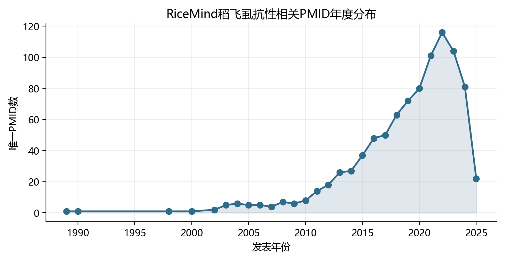
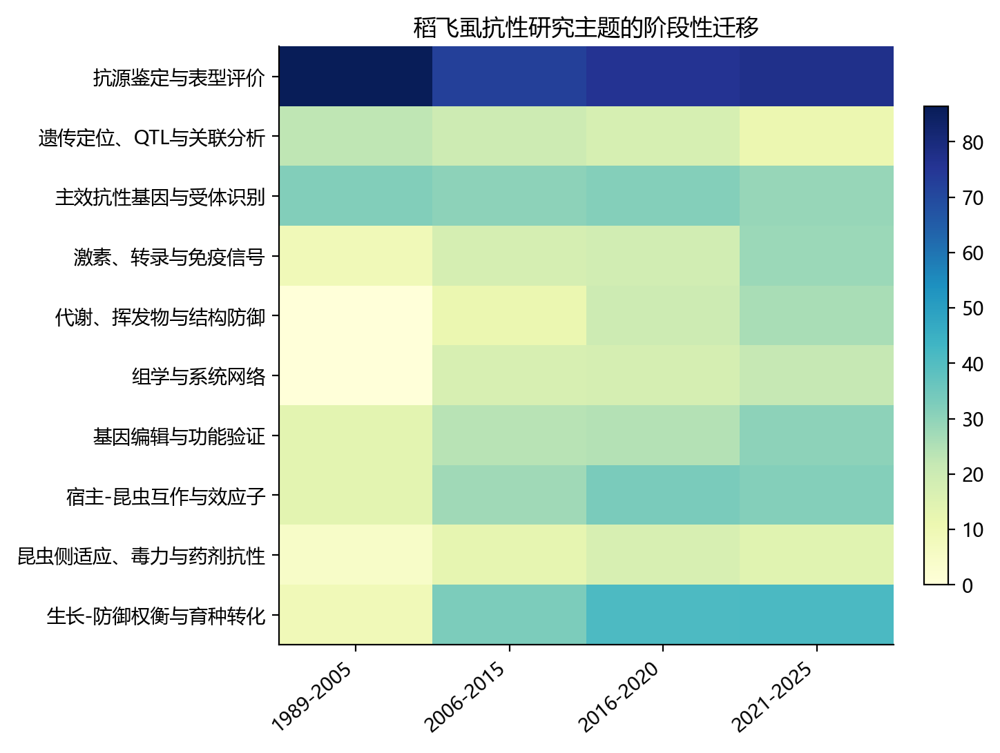
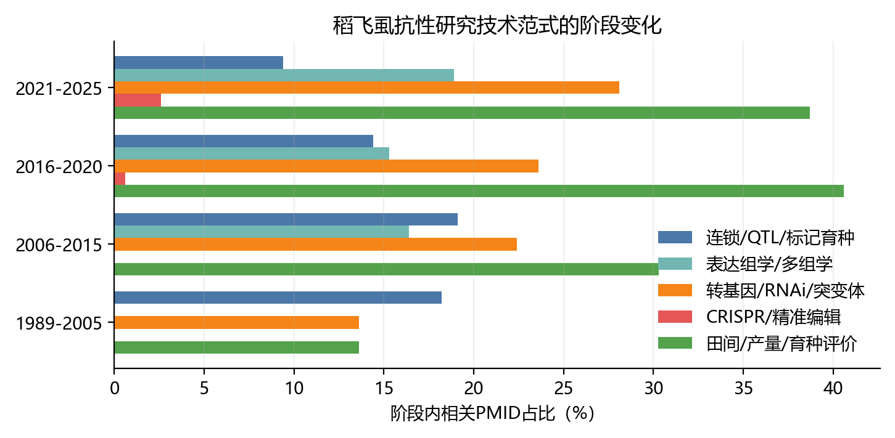

# 水稻飞虱抗性研究态势与发展脉络

**证据基础：** RiceMind 完整分页句子证据  
**证据年份：** 1989–2025 年  
**分析日期：** 2026-06-12

## 摘要

水稻飞虱抗性研究已经从早期的抗源筛选和遗传定位，依次进入主效基因克隆、抗性执行机制解析，以及宿主—昆虫互作网络和生长—防御权衡研究阶段。RiceMind 检索集合包含 5,085 条去重句子证据和 911 个唯一 PMID。按本文划分，1989–2005 年、2006–2015 年、2016–2020 年和 2021–2025 年分别占全部 PMID 的 2.4%、16.7%、34.4% 和 46.5%。这一分布说明研究关注在 2010 年代后快速扩张，但不能被解释为后期研究质量必然高于早期研究；2025 年记录也存在明显的数据库收录时滞。

从学科发展逻辑看，领域已经完成了从“抗性在哪里”到“主效抗性基因是什么”的关键跃迁，也正在从“单基因如何起作用”转向“主效基因、背景修饰因子、昆虫毒力和环境如何共同决定抗性”。然而，从机制知识积累到可预测、耐久和低代价的育种利用之间仍存在断层。当前最突出的问题不是缺少候选基因，而是缺少可跨遗传背景、虫源和环境比较的效应量，以及缺少对抗性耐久性、产量代价和多害虫生态后果的系统验证。

## 1. 证据范围与解释边界

本分析合并了 `brown planthopper resistance`、`Brown planthopper damage`、`white-backed planthopper resistance`、`Whitebacked planthopper damage` 和宽泛查漏词 `planthopper` 的完整分页结果。宽泛检索引入了部分昆虫毒力、药剂抗性及其他植物—昆虫研究，因此本文将其用于识别水稻—飞虱互作研究的外延，而不把其中所有 PMID 都视为水稻宿主抗性基因研究。

主题和方法统计依据题名及 RiceMind 返回的相关句子进行规则化归类。一篇文献可以进入多个主题，百分比不能相加为 100%。这些数字表示当前语料中的文献关注结构，不代表遗传效应大小、基因重要性或育种成熟度。机制性结论则以可追溯 PMID 为依据，并区分直接实验结论与跨研究综合判断。

## 2. 总体研究态势

RiceMind 语料中的唯一 PMID 数量由 2000 年代初的个位数逐渐增长，在 2016 年后进入持续高位，2021–2024 年分别为 101、116、104 和 81 篇。2022 年是当前数据中的数量峰值。2025 年仅收录 22 篇，结合检索日期和数据库更新周期，该下降更可能反映收录不完整，而不能据此判断领域热度下降。

期刊分布显示该领域已经由传统遗传育种期刊扩展到植物分子生物学、组学、昆虫学和综合性期刊。当前语料中 PMID 较多的期刊包括 *International Journal of Molecular Sciences*、*Frontiers in Plant Science*、*Scientific Reports*、*PLOS ONE*、*Rice* 和 *Insects*。这说明研究问题已经明显跨越植物遗传学、分子免疫、昆虫生理和育种应用，但文献分散也增加了综合判断的难度。

<!-- RICEMIND_FIGURE_BLOCK:annual_planthopper_resistance_pmids:START -->

<h3 class="ricemind-figure-heading" style="break-after: avoid; page-break-after: avoid;">文献关注度的年度变化</h3>
<figure class="ricemind-figure" style="break-inside: avoid; page-break-inside: avoid; margin: 1.1em auto 1.4em; text-align: center;">
  
  <figcaption style="font-size: 0.9em; line-height: 1.45; margin: 0.55em auto 0; max-width: 90%;"><strong>图 1.</strong> 按RiceMind合并证据中的唯一PMID统计。数值表示当前语料的文献关注度；2025年存在收录时滞，不能据下降判断研究热度减弱。</figcaption>
</figure>

<!-- RICEMIND_FIGURE_BLOCK:annual_planthopper_resistance_pmids:END -->

## 3. 四个发展阶段

| 阶段 | PMID 数 | 主要问题 | 标志性变化 | 尚未解决的问题 |
|---|---:|---|---|---|
| 1989–2005 | 22 | 哪些材料抗虫，抗性如何遗传 | 抗源评价、数量遗传和初步连锁定位 | 表型标准、效应量和位点复现性不足 |
| 2006–2015 | 152 | 主效位点对应什么基因 | 精细定位、图位克隆、功能标记和基因聚合 | 单基因抗性被虫群适应突破 |
| 2016–2020 | 313 | 抗性基因如何执行防御 | 等位多样性、受体/分泌/代谢机制、反向遗传和组学 | 机制研究与田间育种脱节 |
| 2021–2025 | 424 | 如何获得广谱、耐久且低代价抗性 | 互作效应子、结构防御、精细编辑、权衡分析、GWAS与基因组预测 | 多背景效应量、耐久性和生态权衡缺证 |

### 3.1 1989–2005：抗源、表型与遗传结构奠基

这一阶段的核心任务是确认水稻品种间存在稳定抗性差异，并判断抗性由单个主效位点还是多个数量位点控制。Lemont/Teqing 重组自交系研究已经证明褐飞虱抗性具有数量遗传组分，但当前 RiceMind 句子证据未保留各 QTL 的完整区间和效应量 [12582694]。同期研究也开始使用分子标记定位命名抗性位点，并尝试聚合 Bph1、Bph2 等基因 [12184487, 15032948]。

这一时期建立了此后几十年沿用的两条路线：一条是寻找可提供强抗性的主效基因，另一条是解析品种背景中的数量抗性。后续研究明显偏向第一条路线，因为主效基因更容易定位、克隆和开发标记；数量抗性虽然很早被确认，却长期缺少标准化效应量和可直接部署的位点清单。

### 3.2 2006–2015：主效基因定位与克隆成为中心

2006 年以后，研究主线由“抗性位点在哪里”转向“位点编码什么分子”。Bph14 的鉴定表明 NLR 型免疫受体可以构成褐飞虱抗性的主要遗传入口 [20018701]。随后 BPH26、BPH15 和 BPH29 等基因被图位克隆，显示水稻飞虱抗性并非由单一受体类型承担，而是涉及不同结构类型和不同防御方式 [25076167, 25109872, 26136269]。

这一时期同时形成了近等基因系、功能标记和基因聚合等育种工具，研究目标开始从发现抗性源延伸到把抗性导入优良背景 [23175467, 24273431]。但主效基因路线的局限也逐渐显现：抗性表现依赖水稻背景、飞虱生物型和评价条件，聚合多个基因也不自动等于耐久抗性。昆虫侧的毒力定位和唾液腺表达研究开始把领域引向协同进化问题 [24244529, 24911169]。

### 3.3 2016–2020：从基因身份转向抗性执行机制

2016–2020 年的关键变化是研究重点由“克隆更多 Bph 基因”扩展为“解释这些基因如何产生抗性”。BPH9 的等位多样性揭示同一 NLR 位点可以对应不同飞虱变异，说明抗性谱取决于受体等位形式而非仅取决于基因是否存在 [27791169]。BPH6 被定位为外囊体相关蛋白，其抗性机制连接分泌运输和广谱飞虱抗性 [29358653]；Bph32 则进一步扩大了已知抗性蛋白的结构类型 [27876888]。

与此同时，反向遗传和组学研究将 JA、SA、ABA、乙烯、WRKY 转录调控、黄酮和苯丙烷代谢纳入抗性网络。OsmiR396–OsGRF8–OsF3H 轴和 OsMYB30–OsPAL 通路说明次生代谢不是笼统的“防御增强”，而是受到小 RNA 和转录因子精细控制的抗性执行层 [30734457, 31848246]。IR64 数量抗性 QTL、MAGIC 群体关联位点等工作也重新推动了数量遗传路线 [31297040, 33066559]。

该阶段的学术贡献是把抗性从一个位点性状改写为多层网络性状；其问题是大量功能研究来自单一背景的过表达、沉默或突变材料，能够证明节点参与抗性，却不能回答该节点在自然群体中解释多少变异、能否稳定用于育种。

### 3.4 2021–2025：互作网络、结构防御与低代价抗性

近年的研究开始把抗性基因、下游修饰网络、昆虫效应子和农艺代价放入同一框架。Bph30 通过强化叶鞘厚壁组织提供抗性，说明机械结构本身可以成为主效防御输出 [34246801]；OsPep3–OsPEPRs 研究将内源损伤肽信号与刺吸式昆虫免疫联系起来 [35068048]。OsWRKY71 对 Bph15 抗性的依赖则表明，主效基因的实际效应需要特定背景调控节点才能完整实现 [38023936]。

研究前沿进一步由植物单侧防御转向双向互作。飞虱唾液蛋白和效应子可以操纵水稻免疫与代谢，2025 年的证据甚至显示昆虫效应子能够模拟宿主免疫调节因子 [35217680, 35295635, 39853648]。取食与产卵诱导的防御也不是简单叠加，若虫取食可抑制产卵诱导的间接防御 [39779696]。因此，抗性不再适合被描述为静态的“基因—表型”关系，而应被视为水稻基因型、飞虱群体、发育阶段和行为过程共同决定的动态结果。

育种目标也由“抗性强”转向“抗性强且不减产、不诱发其他虫害”。JAZ10 特定移码等位变异、OsPGI1c 和 OsWRKY36 等研究尝试缓解生长—防御矛盾或获得较广抗谱 [39693337, 39796027, 40042898]；OsTPS19/OsTPS20 介导的柠檬烯防御虽然增强飞虱和病害抗性，却可能改变非目标害虫表现，显示多害虫权衡必须进入育种评价 [39340817]。自然群体 GWAS 和基因组预测开始将数量抗性重新引入选择框架，但候选位点仍需因果验证 [38576786]。

<!-- RICEMIND_FIGURE_BLOCK:theme_transition_by_phase:START -->

<h3 class="ricemind-figure-heading" style="break-after: avoid; page-break-after: avoid;">研究主题从遗传定位向互作网络扩展</h3>
<figure class="ricemind-figure" style="break-inside: avoid; page-break-inside: avoid; margin: 1.1em auto 1.4em; text-align: center;">
  
  <figcaption style="font-size: 0.9em; line-height: 1.45; margin: 0.55em auto 0; max-width: 90%;"><strong>图 2.</strong> 颜色表示各阶段进入相应主题的唯一PMID占该阶段PMID的百分比。一篇文献可进入多个主题，因此各主题百分比不可相加。</figcaption>
</figure>

<!-- RICEMIND_FIGURE_BLOCK:theme_transition_by_phase:END -->

## 4. 学科主线如何演变

### 4.1 遗传学主线：从主效基因中心走向分层遗传架构

主效 Bph/Wbph 基因决定抗性的主要入口，是过去二十年最成功的研究与育种对象。微效 QTL 和功能修饰节点则主要解释抗性强度、持续时间、虫种范围和生长代价。当前证据支持的合理架构不是“主效基因或微效基因二选一”，而是“主效入口 + 背景修饰 + 昆虫毒力 + 环境”的分层模型。

这一认识尚未充分转化为育种数据。严格微效 QTL 的命名、PVE、加性效应和跨群体复现证据远少于功能修饰基因证据；大量所谓“微效基因”实际上只是遗传操作后改变抗性的调控节点，未证明其自然等位变异具有小效应。由此，研究数量的增加并未同步形成可用于基因组选择或分子设计的标准效应矩阵。

### 4.2 机制主线：从识别受体扩展到执行层和调控层

目前可将水稻侧机制概括为三个层次。第一层是 Bph14、BPH9 等主效识别或抗性入口；第二层是细胞壁、厚壁组织、分泌运输、黄酮、苯丙烷和挥发物等执行层；第三层是激素、WRKY、小 RNA、表观遗传和生长—防御开关等调控层 [20018701, 27791169, 29358653, 30734457, 31848246, 34246801]。

这三个层次不能被并列成同等育种价值的“抗性基因清单”。主效入口通常解释较大的抗性差异；执行层和调控层更适合用于增强、稳定或扩展主效基因的表现。未来机制研究的价值将取决于能否说明某个修饰节点在什么主效基因背景、什么虫源和什么环境下产生多大增益。

### 4.3 互作主线：从植物防御转向协同进化和行为时序

早期研究把飞虱主要视为统一的胁迫处理，近年的研究则把不同生物型、唾液效应子、共生微生物、取食阶段和产卵行为纳入模型。昆虫毒力基因组定位和效应子研究表明，水稻抗性会对飞虱群体施加选择压力，而飞虱的适应又会重塑抗性基因的有效期 [24911169, 26668110, 28098179, 39336620]。

因此，“广谱”和“耐久”必须由多虫源、连续世代和竞争生态试验支持，而不能只根据单次苗期鉴定或一个实验室种群下结论。水稻—褐飞虱互作已成为该领域最重要的理论增长点，也是连接分子机制与抗性失效风险的关键。

### 4.4 技术主线：定位技术减少，功能扰动与组学增加

主题归类显示，连锁/QTL/标记育种相关文献在各阶段中的占比由早期的约 18% 降至 2021–2025 年的约 9%，而表达组学/多组学由早期几乎没有增加到约 19%，转基因、RNAi 或突变体相关证据增加到约 28%。CRISPR 的明确题名或句子记录仍只占近年语料的一小部分，说明精准编辑已进入研究流程，但尚未取代传统功能验证。

这种技术迁移扩大了机制分辨率，却产生新的证据不对称：发现和功能扰动越来越容易，跨环境效应估计和育种验证仍然昂贵。领域正在形成“候选越来越多、可部署等位基因仍然少”的结构性矛盾。

<!-- RICEMIND_FIGURE_BLOCK:method_transition_by_phase:START -->

<h4 class="ricemind-figure-heading" style="break-after: avoid; page-break-after: avoid;">研究工具由定位向功能扰动和组学迁移</h4>
<figure class="ricemind-figure" style="break-inside: avoid; page-break-inside: avoid; margin: 1.1em auto 1.4em; text-align: center;">
  
  <figcaption style="font-size: 0.9em; line-height: 1.45; margin: 0.55em auto 0; max-width: 90%;"><strong>图 3.</strong> 比较不同阶段中定位育种、组学、功能扰动、精准编辑和田间/产量评价的语料占比。该图反映研究方法关注度，不代表证据质量。</figcaption>
</figure>

<!-- RICEMIND_FIGURE_BLOCK:method_transition_by_phase:END -->

## 5. 当前研究格局的优势与短板

当前优势是主效抗性基因资源丰富，多个受体类型和执行机制已经被解析；同时，近等基因系、基因聚合、反向遗传、多组学和基因编辑工具已经形成较完整的研究链条。研究对象也开始从单一 BPH 扩展到 WBPH、SBPH、病原菌和咀嚼式害虫之间的抗性权衡。

主要短板首先是 BPH 研究明显多于 WBPH 和 SBPH，跨虫种结论经常由有限材料外推。其次，苗期室内抗性、成株期田间抗性和最终产量保护之间尚无统一转换关系。再次，主效基因研究与微效背景研究之间缺少桥接实验：多数论文要么研究单个主效基因，要么研究一个调控节点，较少在多主效基因、多背景和多生物型矩阵中估计互作效应。最后，抗性耐久性研究仍落后于抗性发现，飞虱毒力进化、迁飞群体差异和长期选择后的抗性衰减缺少标准化数据。

## 6. 未来研究的五个增长方向

第一，研究单位应由“基因”升级为“基因/等位变异 × 水稻背景 × 飞虱群体 × 环境”。每个候选都需要报告可比较的效应量、置信区间、产量代价和虫源信息，而不是只报告显著性。

第二，主效基因与微效修饰因子应被放入同一遗传设计。优先验证的不是孤立微效节点，而是能够提高 Bph14、Bph15、BPH9、BPH6 等主效基因稳定性或降低代价的背景因子。OsWRKY71 对 Bph15 的依赖已经提供了这种研究范式 [38023936]。

第三，耐久性评价应显式纳入飞虱进化。需要使用多地虫源、连续世代选择、混合生物型和迁飞群体，比较单基因、基因聚合和主效基因加修饰因子的失效速度。否则，短期高抗不能被称为耐久抗性。

第四，基因编辑应由完全敲除转向等位基因设计、启动子编辑和组织或诱导特异调控。JAZ10 移码等位变异说明，精细改变调控强度可能比删除基因更有机会缓解生长—防御冲突 [39693337]。

第五，育种目标应从单虫种抗性转向稻田病虫生态系统中的净收益。挥发物、JA/SA 分配和结构防御可能同时影响 BPH、WBPH、SBPH、螟虫、病原菌和天敌。未来材料必须同步评价目标害虫、非目标害虫、病害、产量和品质，防止把虫谱替换误判为广谱抗性 [19656341, 39340817, 40042898]。

## 7. 总体判断

水稻飞虱抗性研究已由经典遗传学和单基因克隆，进入互作网络、数量遗传和精准调控并行的阶段。基础研究层面，领域正在从“抗性由哪个基因产生”转向“抗性为何在不同背景、虫源和环境中失效或保持”；应用层面，则正从主效基因导入和简单聚合，转向兼顾耐久性、广谱性和农艺代价的组合设计。

这个转型尚未完成。现有研究足以构建较丰富的机制网络，却不足以稳定预测一个基因组合在不同生态区的最终育种价值。下一阶段真正具有推动力的工作，不是继续扩张候选清单，而是建立主效基因、微效背景、飞虱毒力和环境互作的标准化效应数据库，并用多地点、多虫源和连续世代试验验证设计型抗性组合。

## 数据附件

- `article_classification.csv`：911 个 PMID 的阶段、主题、方法和检索范围归类。
- `annual_publication_counts.csv`：年度唯一 PMID 数量。
- `phase_summary.csv`：四阶段文献数量和占比。
- `theme_by_phase.csv`：各阶段主题关注结构。
- `method_by_phase.csv` 与 `method_by_phase_wide.csv`：各阶段技术类型变化。
- `journal_counts.csv`：期刊分布。
